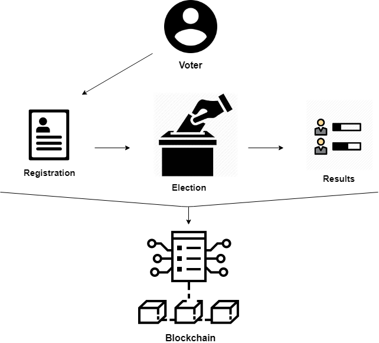

# ONSE
One Nation Secure Election

## Problem:
In every election, the voting turnout is less than 50% in some areas. Voters not being able to attend their respective constituencies is one of the main reason for this problem. We aim to solve this problem by giving the user freedom to vote from anywhere in India. We believe this can drastically increase the voting turnout.

## Solution:
Our project contains two modules.

### Voting:
Through this module, we aim to build an online service portal which will be deployed across all the voting centers. When the respective voter goes to one of the service center,once he authenticates himself,his constituency ballot will be displayed where he can vote securely akin to the EVM'S. This portal will guarantee anonymity and prevents duplicate votes.

### Registration and Results:
Through this module, we will build a website deployed across all the general users. It will have the following features.

**Registration Page:**
- Validation using aadhar APIs
- Verification of age

**Results Page:**
- Realtime constituency wise analytics of voter turnout on the internet
- Instant results after the election stops

All the data created during registration and voting will be sent through their respective smart contracts and then stored in a blockchain using Azure blockchain to ensure data security and validity.

